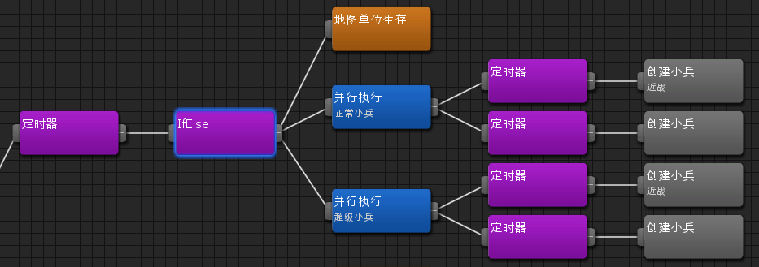
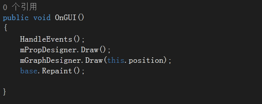
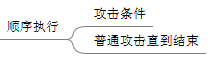
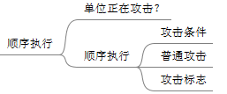
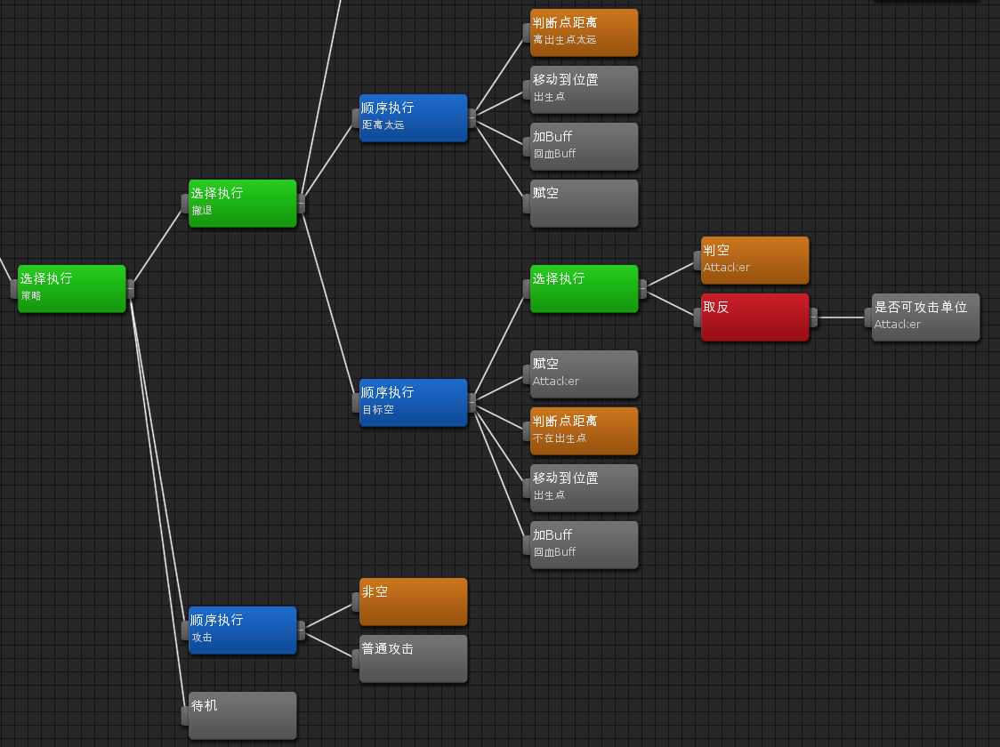
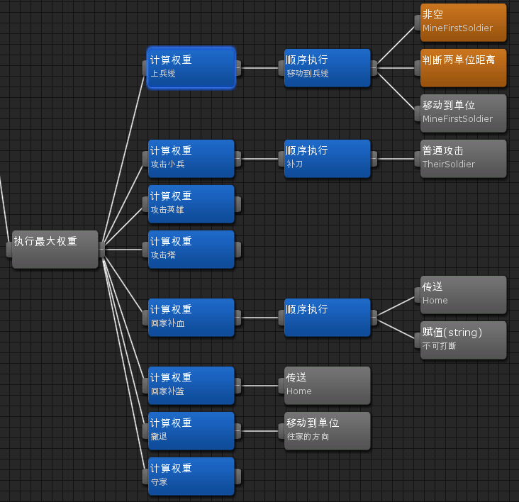

# Moba游戏AI设计
近段时间在研究游戏的AI，AI简单来说就是游戏中与玩家对战，或者帮玩家托管挂机，能像人类一样思考的机器人。这应该是游戏开发中最迷人最炫酷的一门技术了。我们做的是Moba类游戏，对AI的要求就是达到LOL的人机对战的思考程度。

工欲善其事必先利其器，要做复杂的AI，行为树编辑器这个工具必不可少。我共花了一个多月的时间去做这个东西，并把AI相关的框架重写了。这货应该是我当程序这么久写过的最实用的一个工具了。

## 策划or程序？
设计行为树框架的时候，我在想，这玩意应该给谁来配呢，程序还是策划？行为树本质来说就是if else，它把代码分片段可视化的呈现在你面前。这也决定了，行为树本身就是逻辑性非常强的东西。比方说，判断距离，如果在策划的思维里，他们需要很多类型的节点才能满足需求，判断与建筑的距离，判断与小兵的距离，判断与英雄的距离，判断与泉水的距离。而我的解决方案是，先把要进行判断的单位保存到一个变量里，就只需要一个判断距离的节点了。

如果这套AI要策划专用，那么程序就需要提供海量的节点类型才能满足策划。身为程序员，做这种大量重复又没有意义的工作是可耻的。所以我干脆把它做成了程序专用，为程序员准备了if else，for循环，变量定义赋值，甚至连类似函数的子树功能都做了，简直成了代码编辑器。

AI的设计流程应该是，策划提供方案，程序把行为树框架搭起来并向策划讲解，最后策划来调行为树的数值。

## 通用 or 专用？
行为树编辑器的设计之初，我考虑过，这个工具应该把它做成通用的，还是我们项目专用的呢。我看了unity编辑器扩展后，终于决定将其做成专用版。

Unity的最初版本跟我以前做编辑器的思路有点相似。就是编辑器和游戏用的是同一套gui，这种做法可以让编辑器的扩展更加灵活，并且可以更加方便的对运行时的游戏进行编辑。我现在终于有点理解为什么早期的unity的gui那么难用，它的绘图逻辑就是逐帧画ui，控件之间没有父子层级关系，这种框架对于游戏ui是极其的糟糕，但对编辑器多变的ui却十分方便。

但用UnityEditor来做这种专用工具有个很严重的缺点，就是离开了unity甚至离开了这个项目，这个工具就没法用了。

## 协程or逐帧？
我们都知道，决策树是一帧帧执行的，随着时间的推移，条件的改变，做出不同的决策。但行为树在执行的过程中经常执行一些持续性的行为节点，例如普通攻击，分为攻击前摇和后摇，这个过程将会持续1秒。而在这段时间内，攻击条件依然符合，所以行为树下一帧执行到这里依然会发出攻击指令，这样会造成不断的播放攻击前摇的鬼畜现象。

解决这个问题，有两种解决方案，一种是利用脚本的一些特性，比如python和lua的协程，把执行行为树的逻辑挂起，等这个攻击动作结束后接着往下执行，这种做法的好处是逻辑更加直观。另一种是，在发出攻击指令后在行为树打一个标志，下一帧的如果发现这个标志，就不进行任何操作，这种做法的好处是随时可以中断动作。

经尝试，很多执行动作的过程都会被打断，用第二种方案会更好实现些。

## 群组 or 个人？
机器人ai的设计与我们人类打游戏的思维有点类似，个人主义与团队合作总是存在冲突的。比方说，机器人A和机器人B都是上单英雄，他们都跑到上路了，他们都给对方发送了离开上路兵线的指令。如果像这样各行其是的执行自己的行为树的话，会造成逻辑的混乱，像Gank，打野这些功能就没法做了。

我的做法是加入群组的概念，群组就像是这个团队的指挥部，它会根据队伍里的人员特性，给每个成员发送指令，比如带哪一路兵线，去辅助哪个队友，去哪里抓人，打boss之类的，成员收到指令后，可以根据自己的状态，权衡是否要执行这条指令。这样更符合人的思维，也能避免一些逻辑上的混乱。

## 权重 or 逻辑？
在一些规则是定死而且不太复杂的ai，我会根据规则把逻辑理清，直接用selector节点把决策树画出来。

但像英雄AI这种超大规模的逻辑，我用权重公式来解决。但这个需要数值策划相关的知识才能让机器的决策更加科学。像带线的AI(k1,k2..为权重系数，需要数值策划来微调)：

上兵线权重 = 与兵线距离/k1

攻击小兵权重 =  k2/小兵距离

回城权重 =  (最大血量-当前血量)/最大血量*k3

撤退权重 = 危险系数*k4

...

## 如何调试
我这里说的调试不是打断点，因为行为树是多棵树同时逐帧执行的，所以断点测试非常不好搞。以前测试行为树方法是在后端打log，一秒钟满屏的log，坑爹看到眼花。我利用游戏现有的网络模块向服务器发送我要测试的单位，然后服务器把每帧的执行结果发到前端。不用重复写网络功能，也是我选择unity扩展很重要一部分原因。

