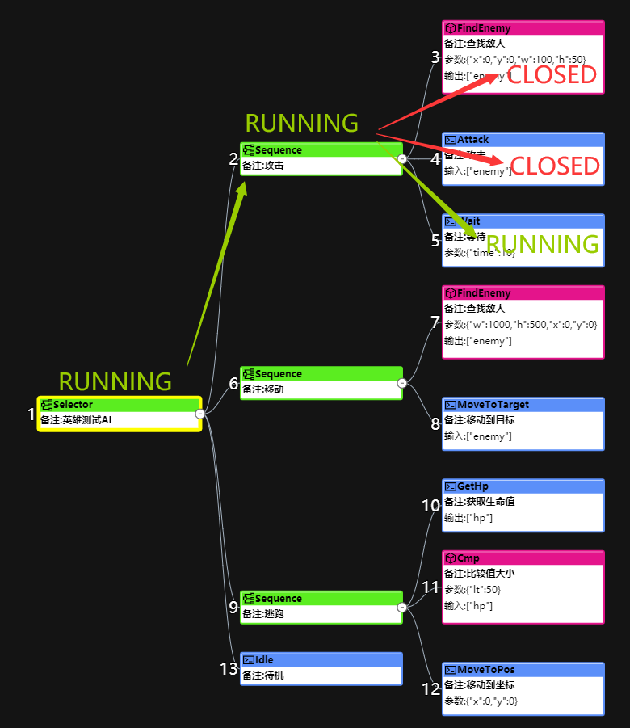
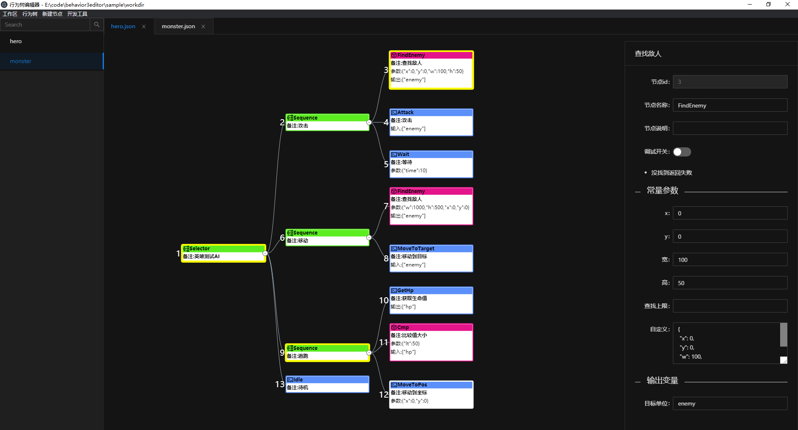

# 行为树框架 for Lua
机缘巧合，近几年的工作一直有涉及到游戏AI这块，网上常见的行为树+黑板似乎不太能满足复杂策划需求，也不太可能让策划自己去配置这种行为树。因此，我对行为树的黑板进行了小改造，让行为树更像一个代码编辑器，我们程序提供为数不多的行为节点，让策划通过编辑行为树来实现他们想要的逻辑，这对于游戏程序员来说也算是一种解放吧。

## 基本概念
#### 节点数据结构
```lua
{
    name = 'find_enemy',        -- 节点名称
    desc = '查找敌人'，          -- 说明
    args = {w = 100, h = 50},   -- 常量配置
    input = {'var1', 'var2'},   -- 输入变量
    output = {'target'},        -- 输出变量
    children = {}               -- 子节点
}
```
#### 常量
通常是固定值，比如范围，类型之类的
#### 输入/输出变量
因为节点之间都有相互的影响，比如这个节点可能会用到上一个节点所产生的数据，所以大多数行为树设计者都提供一个数据结构来记录行为树的运行状态，称之为“黑板”。

我偷换了个概念，把节点当成一个function来执行，如上面一个节点定义的input={'var1', 'var2'}意思是在执行节点前从黑板里把var1和var2这两个变量取出来，作为参数传进去，在节点执行完后把结果返回，写到target这个变量上。整个过程就像下面这段伪代码：
```lua
function find_enemy(var1, var2)
    local w, h = args.w, args.h
    // do find enemy in range w, h
    ...
    return target
end
```
上面这个节点执行完，黑板上target这个变量就写上了查找到的目标，而后面的节点就可以使用target这个变量作为input了。
```lua
{
    name = 'attack',
    desc = '攻击敌人',
    args = {skill = 101},
    input = {'target'},
}
```
#### 状态返回
+ SUCCESS 成功
+ FAIL 失败
+ RUNNING 正在运行

## 复合节点
+ Parallel 并行执行, 执行所有子节点并反回true
+ Sequence 顺序执行，执行所有子节点直到返回false
+ Selector 选择执行，执行所有子节点直到返回true

## 装饰节点
+ Not 取反
+ AlwaysSuccess
+ AlwaysFail

## 行为节点
+ Wait 等待一段时间后继续执行
+ MoveToTarget 移动到目标
+ GetHp 获取生命值
+ Attack 攻击目标

## API
+ new 创建新的行为树对象
+ run 执行一次tick
+ set_var 设置变量
+ get_var 获取变量

## Running状态
做行为树始终绕不开一个问题，就是running状态，如果一套行为树方案没有running状态，那它只能用来做决策树，而不能做持续动作。要想实现running状态，关键是如何用上一次运行的节点恢复起来。行为树的节点调用很像程序的调用栈，其实对复合节点稍做改造即可实现：
+ 只要是有任意子节点返回的是RUNNING, 立即返回RUNNING。
+ 运行节点前把节点压入栈，如果该节点返回RUNNING，则中断执行，等待下次tick唤醒，如果返回的是SUCCESS或FAIL，则出栈，继续往下执行。


## 编辑器
我用阿里的g6图形库开发了一个通用的行为树编辑器，并用electron打包成exe版本，目前还比较简陋，感兴趣的同学可以关注一下 [behavior3editor](https://github.com/zhandouxiaojiji/behavior3editor)


## 运行测试用例
+ 导出节点定义
```
lua export_node.lua
```
+ 运行测试
```
lua test.lua
```

## 调试方案
我以前的做法是，把每一tick所有的节点执行结果都发给编辑器然后在编辑器上展示，非常详细，但实际应用却很鸡肋，太多冗余的数据让人眼花缭乱。我目前的做法是在编辑行为树的时候，把需要调试的节点打上标志，当行为树运行到这个节点的时候，打印这个节点相关的日志，比如时间/帧数，执行结果，及所有变量的值。

## About
这套方案我已经在好几个项目中使用过，动作，卡牌，MOBA，MMO类都有，提供三四十种节点，基本上策划可以自己配置出一套很复杂的AI，当然还可以使用在技能系统之类的，需要更直观的逻辑表现的系统。这仅仅是一种思路，各位路过的大神，有啥建议或看法，欢迎Issue。
