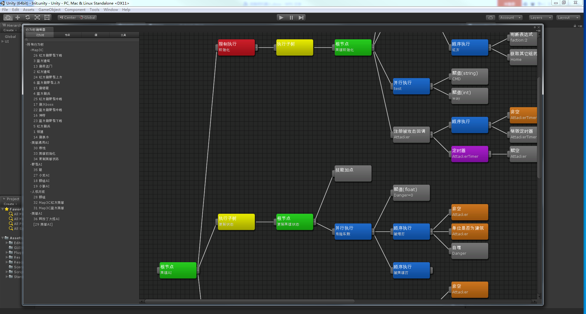

# 另类的行为树设计方案
机缘巧合，近几年的工作一直有涉及到游戏AI这块，网上常见的行为树+黑板似乎不太能满足复杂策划需求，也不太可能让策划自己去配置这种行为树。因此，我对行为树的黑板进行了小改造，让行为树更像一个代码编辑器，我们程序提供为数不多的行为节点，让策划通过编辑行为树来实现他们想要的逻辑，这对于游戏程序员来说也算是一种解放吧。

之前写过好多种语言的版本，我重新写了一份精简的lua版，只是为了展示用，不考虑性能问题。

## 编辑器
N年前用Unity扩展写过一个行为树编辑器，功能比较强大，还能调试。这个代码就不开源了，因为unity版本太低，跟项目耦合太多，没法单独使用。我还写过一篇类似文档的东西，可以参考一下。

专门写编辑器成本太高，我现在使用Freemind这款思维导图软件作为我们的编辑器，按照约定的格式画好，保存成xml格式，再转换成项目使用的格式。

## 运行测试用例

## About
这套方案我已经在好几个项目中使用过，动作，卡牌，MOBA，MMO类都有，教会策划，快活一年。这仅仅是一种思路，各位路过的大神，有啥建议或看法，欢迎提Issue。